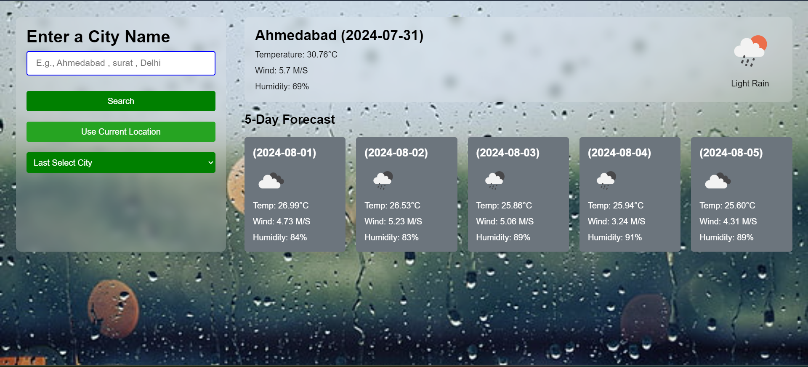

Here's the documentation for your Weather App project:

---

## Weather App Project Documentation

### Table of Contents
1. [Introduction](#introduction)
2. [Features](#features)
3. [Technologies Used](#technologies-used)
4. [Setup and Installation](#setup-and-installation)
5. [File Structure](#file-structure)
6. [HTML Explanation](#html-explanation)
7. [CSS Explanation](#css-explanation)
8. [JavaScript Explanation](#javascript-explanation)
9. [API Key](#api-key)
10. [Usage](#usage)
11. [License](#license)

### Introduction
The Weather App Project is a web application that allows users to search for and view weather forecasts for different cities. It uses the OpenWeatherMap API to fetch and display current weather data as well as a 5-day forecast.

### Features
- Search for weather by city name
- Use current location to get weather data
- Display current weather details (temperature, wind speed, humidity)
- Display 5-day weather forecast
- Save and display recently searched cities

### Technologies Used
- HTML
- CSS (including Tailwind CSS)
- JavaScript

### Setup and Installation
1. Clone the repository:
   ```bash
   git clone https://github.com/parthu311/Weather-Website.git
   ```
2. Navigate to the project directory:
   ```bash
   cd weather-app
   ```
3. Open `index.html` in your browser to run the application.

### File Structure
```
weather-app/
│
├── index.html
├── style.css
└── script.js
```

### HTML Explanation
The HTML file (`index.html`) sets up the structure of the web application. It includes the following sections:
- **Head Section**: Contains meta information, the title, and links to the CSS file and JavaScript file.
- **Body Section**: Contains the main content of the application:
  - **Weather Input Section**: Includes an input field for entering a city name, a search button, a button to use the current location, and a dropdown for recently searched cities.
  - **Weather Data Section**: Displays the current weather and a 5-day forecast.

### CSS Explanation
The CSS file (`style.css`) styles the application using Tailwind CSS utilities along with some custom styles:
- **General Styles**: Reset margins and padding, set a background image, and use a specific font.
- **Container**: Flexbox layout with gap and padding.
- **Weather Input**: Styling for the input fields, buttons, and dropdown.
- **Weather Data**: Styling for the current weather and forecast sections.

### JavaScript Explanation
The JavaScript file (`script.js`) contains the functionality of the application:
- **Elements Selection**: Selects DOM elements like input fields, buttons, and divs.
- **API Key**: Defines the API key for OpenWeatherMap.
- **Weather Fetching Functions**: Functions to fetch weather data based on city name or current location.
- **Weather Display Functions**: Functions to create and display weather cards for current weather and forecast.
- **LocalStorage Functions**: Functions to save and retrieve recently searched cities from localStorage.
- **Event Listeners**: Adds event listeners to buttons and dropdowns for user interaction.

### API Key
The application uses an API key from OpenWeatherMap to fetch weather data. Replace the placeholder API key in the `script.js` file with your own API key:
```javascript
const API_KEY = "your_api_key_here";
```

### Usage
1. Enter a city name in the input field and click the "Search" button or press Enter.
2. Click the "Use Current Location" button to fetch weather data for your current location.
3. Select a city from the dropdown to quickly view its weather data again.

### License
This project is licensed under the MIT License.

---

Feel free to customize this documentation to fit your needs or add any additional information you think is necessary.